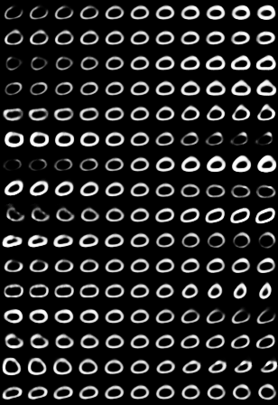
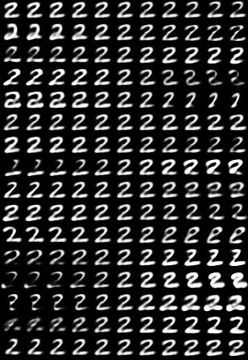
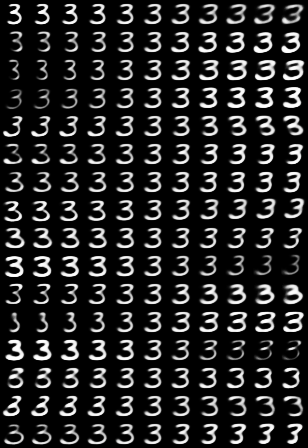
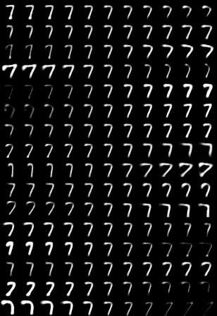

This implementation is fork of https://github.com/XifengGuo/CapsNet-Keras , applied to CIFAR-10 dataset.

# CapsNet-Keras
[](https://github.com/XifengGuo/CapsNet-Keras/blob/master/LICENSE)

A Keras implementation of CapsNet in the paper:   
[Sara Sabour, Nicholas Frosst, Geoffrey E Hinton. Dynamic Routing Between Capsules. NIPS 2017](https://arxiv.org/abs/1710.09829)   
The current `average test error = 0.34%` and `best test error = 0.30%`.   
 
**Differences with the paper:**   
- We use the learning rate decay with `decay factor = 0.9` and `step = 1 epoch`,    
while the paper did not give the detailed parameters (or they didn't use it?).
- We only report the test errors after `50 epochs` training.   
In the paper, I suppose they trained for `1250 epochs` according to Figure A.1?
Sounds crazy, maybe I misunderstood.
- We use MSE (mean squared error) as the reconstruction loss and 
the coefficient for the loss is `lam_recon=0.0005*784=0.392`.   
This should be **equivalent** with using SSE (sum squared error) and `lam_recon=0.0005` as in the paper.


**TODO**
- Conduct experiments on other datasets. 
- Explore interesting characteristics of CapsuleNet.

**Contacts**
- Your contributions to the repo are always welcome. 
Open an issue or contact me with E-mail `guoxifeng1990@163.com` or WeChat `wenlong-guo`.


## Usage

**Step 1.
Install [Keras>=2.0.7](https://github.com/fchollet/keras) 
with [TensorFlow>=1.2](https://github.com/tensorflow/tensorflow) backend.**
```
pip install tensorflow-gpu
pip install keras
```

**Step 2. Clone this repository to local.**
```
git clone https://github.com/XifengGuo/CapsNet-Keras.git capsnet-keras
cd capsnet-keras
```

**Step 3. Train a CapsNet on MNIST**  

Training with default settings:
```
python capsulenet.py
```

More detailed usage run for help:
```
python capsulenet.py -h
```

**Step 4. Test a pre-trained CapsNet model**

Suppose you have trained a model using the above command, then the trained model will be
saved to `result/trained_model.h5`. Now just launch the following command to get test results.
```
$ python capsulenet.py -t -w result/trained_model.h5
```
It will output the testing accuracy and show the reconstructed images.
The testing data is same as the validation data. It will be easy to test on new data, 
just change the code as you want.

You can also just *download a model I trained* from 
https://pan.baidu.com/s/1sldqQo1
or
https://drive.google.com/open?id=1A7pRxH7iWzYZekzr-O0nrwqdUUpUpkik


**Step 5. Train on multi gpus**   

This requires `Keras>=2.0.9`. After updating Keras:   
```
python capsulenet-multi-gpu.py --gpus 2
```
It will automatically train on multi gpus for 50 epochs and then output the performance on test dataset.
But during training, no validation accuracy is reported.

## Results

#### Test Errors   

CapsNet classification test **error** on MNIST. Average and standard deviation results are
reported by 3 trials. The results can be reproduced by launching the following commands.   
 ```
 python capsulenet.py --routings 1 --lam_recon 0.0    #CapsNet-v1   
 python capsulenet.py --routings 1 --lam_recon 0.392  #CapsNet-v2
 python capsulenet.py --routings 3 --lam_recon 0.0    #CapsNet-v3 
 python capsulenet.py --routings 3 --lam_recon 0.392  #CapsNet-v4
```
   Method     |   Routing   |   Reconstruction  |  MNIST (%)  |  *Paper*    
   :---------|:------:|:---:|:----:|:----:
   Baseline |  -- | -- | --             | *0.39* 
   CapsNet-v1 |  1 | no | 0.39 (0.024)  | *0.34 (0.032)* 
   CapsNet-v2  |  1 | yes | 0.36 (0.009)| *0.29 (0.011)*
   CapsNet-v3 |  3 | no | 0.40 (0.016)  | *0.35 (0.036)*
   CapsNet-v4  |  3 | yes| 0.34 (0.016) | *0.25 (0.005)*
   
Losses and accuracies:   


#### Training Speed 

About `100s / epoch` on a single GTX 1070 GPU.   
About `80s / epoch` on a single GTX 1080Ti GPU.   
About `55s / epoch` on two GTX 1080Ti GPU by using `capsulenet-multi-gpu.py`.      

#### Reconstruction result  

The result of CapsNet-v4 by launching   
```
python capsulenet.py -t -w result/trained_model.h5
```
Digits at top 5 rows are real images from MNIST and 
digits at bottom are corresponding reconstructed images.


#### Manipulate latent code

```
python capsulenet.py -t --digit 5 -w result/trained_model.h5 
```
For each digit, the *i*th row corresponds to the *i*th dimension of the capsule, and columns from left to 
right correspond to adding `[-0.25, -0.2, -0.15, -0.1, -0.05, 0, 0.05, 0.1, 0.15, 0.2, 0.25]` to 
the value of one dimension of the capsule. 

As we can see, each dimension has caught some characteristics of a digit. The same dimension of 
different digit capsules may represent different characteristics. This is because that different 
digits are reconstructed from different feature vectors (digit capsules). These vectors are mutually 
independent during reconstruction.
    









## Other Implementations

- PyTorch:
  - [XifengGuo/CapsNet-Pytorch](https://github.com/XifengGuo/CapsNet-Pytorch)
  - [timomernick/pytorch-capsule](https://github.com/timomernick/pytorch-capsule)
  - [gram-ai/capsule-networks](https://github.com/gram-ai/capsule-networks)
  - [nishnik/CapsNet-PyTorch](https://github.com/nishnik/CapsNet-PyTorch.git)
  - [leftthomas/CapsNet](https://github.com/leftthomas/CapsNet)
  
- TensorFlow:
  - [naturomics/CapsNet-Tensorflow](https://github.com/naturomics/CapsNet-Tensorflow.git)   
  I referred to some functions in this repository.
  - [InnerPeace-Wu/CapsNet-tensorflow](https://github.com/InnerPeace-Wu/CapsNet-tensorflow)   
  - [chrislybaer/capsules-tensorflow](https://github.com/chrislybaer/capsules-tensorflow)

- MXNet:
  - [AaronLeong/CapsNet_Mxnet](https://github.com/AaronLeong/CapsNet_Mxnet)
  
- Chainer:
  - [soskek/dynamic_routing_between_capsules](https://github.com/soskek/dynamic_routing_between_capsules)

- Matlab:
  - [yechengxi/LightCapsNet](https://github.com/yechengxi/LightCapsNet)
